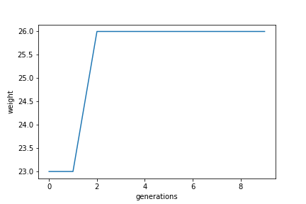

# 3. Genetic Algorithms

## Knapsack problem

<table class="table table-bordered table-hover table-condensed">
<thead><tr><th title="Field #1">data</th>
<th title="Field #2">price dependency</th>
<th title="Field #3">weight dependency</th>
<th title="Field #4">price</th>
<th title="Field #5">weight</th>
<th title="Field #6">time, s</th>
</tr></thead>
<tbody><tr>
<td>p01</td>
<td></td>
<td></td>
<td align="right">309</td>
<td align="right">165</td>
<td align="right">0.000366</td>
</tr>
<tr>
<td>p02</td>
<td></td>
<td></td>
<td align="right">51</td>
<td align="right">26</td>
<td align="right">0.000357</td>
</tr>
<tr>
<td>p03</td>
<td></td>
<td></td>
<td align="right">150</td>
<td align="right">190</td>
<td align="right">0.00031</td>
</tr>
<tr>
<td>p04</td>
<td></td>
<td></td>
<td align="right">107</td>
<td align="right">50</td>
<td align="right">0.000315</td>
</tr>
<tr>
<td>p05</td>
<td></td>
<td></td>
<td align="right">900</td>
<td align="right">104</td>
<td align="right">0.000338</td>
</tr>
<tr>
<td>p06</td>
<td></td>
<td></td>
<td align="right">1721</td>
<td align="right">168</td>
<td align="right">0.000321</td>
</tr>
<tr>
<td>p07</td>
<td></td>
<td></td>
<td align="right">1458</td>
<td align="right">749</td>
<td align="right">0.000364</td>
</tr>
</tbody></table>

## Travelling salesman problem

<table class="table table-bordered table-hover table-condensed">
<thead><tr><th title="Field #1">data</th>
<th title="Field #2">cost dependency</th>
<th title="Field #3">cost</th>
<th title="Field #4">time, s</th>
</tr></thead>
<tbody><tr>
<td>a280</td>
<td></td>
<td align="right">2818.62</td>
<td align="right">11.3691</td>
</tr>
<tr>
<td>att48</td>
<td></td>
<td align="right">43076.8</td>
<td align="right">1.55692</td>
</tr>
<tr>
<td>bays29</td>
<td></td>
<td align="right">2066.0</td>
<td align="right">0.891759</td>
</tr>
<tr>
<td>ch150</td>
<td></td>
<td align="right">25949.7</td>
<td align="right">6.18817</td>
</tr>
<tr>
<td>fl417</td>
<td></td>
<td align="right">44256.6</td>
<td align="right">21.7564</td>
</tr>
<tr>
<td>gr17</td>
<td></td>
<td align="right">2085.0</td>
<td align="right">0.508713</td>
</tr>
</tbody></table>
