# 4. Quadratic assignment problem

## Local search - best improvement

<figure class = "ls">
	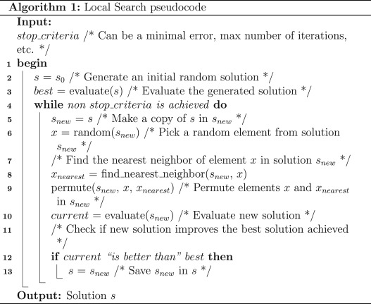
	<figcaption><a href="https://doi.org/10.1016/B978-0-12-822844-9.00005-0">source image</a></figcaption>
</figure>

<table class="table table-bordered table-hover table-condensed">
<thead><tr><th title="Field #1">data</th>
<th title="Field #2">cost dependency</th>
<th title="Field #3">best cost</th>
<th title="Field #4">solution</th>
<th title="Field #5">avg time, s</th>
</tr></thead>
<tbody><tr>
<td>tai20a</td>
<td>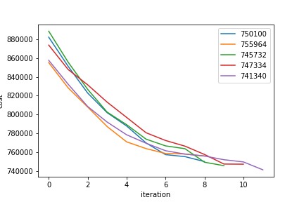</td>
<td align="right">741340</td>
<td><a href="test_results/ls/tai20a.sol">tai20a.sol</a></td>
<td align="right">0.0319554</td>
</tr>
<tr>
<td>tai40a</td>
<td>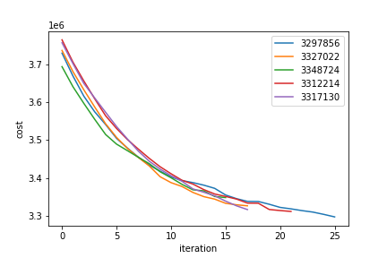</td>
<td align="right">3297856</td>
<td><a href="test_results/ls/tai40a.sol">tai40a.sol</a></td>
<td align="right">0.97884</td>
</tr>
<tr>
<td>tai60a</td>
<td>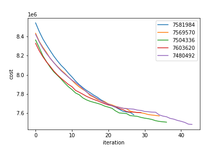</td>
<td align="right">7480492</td>
<td><a href="test_results/ls/tai60a.sol">tai60a.sol</a></td>
<td align="right">8.20662</td>
</tr>
<tr>
<td>tai80a</td>
<td>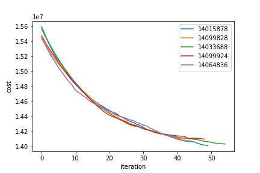</td>
<td align="right">14015878</td>
<td><a href="test_results/ls/tai80a.sol">tai80a.sol</a></td>
<td align="right">36.6371</td>
</tr>
<tr>
<td>tai100a</td>
<td>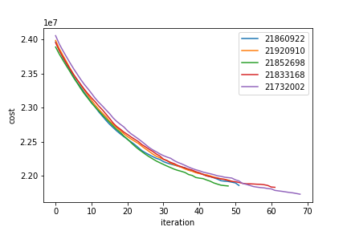</td>
<td align="right">21732002</td>
<td><a href="test_results/ls/tai100a.sol">tai100a.sol</a></td>
<td align="right">105.654</td>
</tr>
</tbody></table>

## Iterated local search - stochastic k-opt

<figure class = "ils">
	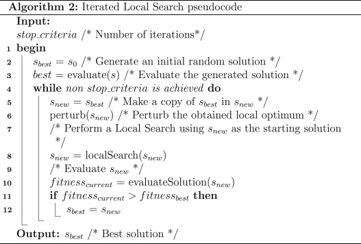
	<figcaption><a href="https://doi.org/10.1016/B978-0-12-822844-9.00005-0">source image</a></figcaption>
</figure>

<table class="table table-bordered table-hover table-condensed">
<thead><tr><th title="Field #1">data</th>
<th title="Field #2">cost dependency</th>
<th title="Field #4">best cost</th>
<th title="Field #3">solution</th>
<th title="Field #5">avg time, s</th>
</tr></thead>
<tbody><tr>
<td>tai20a</td>
<td>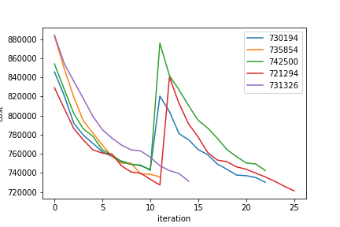</td>
<td align="right">721294</td>
<td><a href="test_results/ils/tai20a.sol">tai20a.sol</a></td>
<td align="right">0.17917</td>
</tr>
<tr>
<td>tai40a</td>
<td>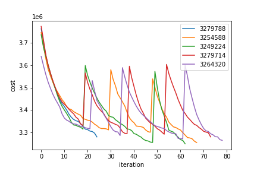</td>
<td align="right">3249224</td>
<td><a href="test_results/ils/tai40a.sol">tai40a.sol</a></td>
<td align="right">4.65746</td>
</tr>
<tr>
<td>tai60a</td>
<td>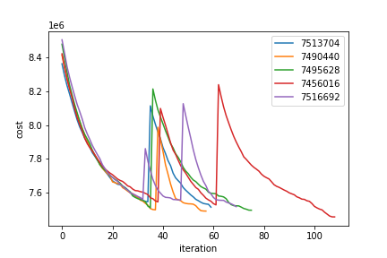</td>
<td align="right">7456016</td>
<td><a href="test_results/ils/tai60a.sol">tai60a.sol</a></td>
<td align="right">34.4535</td>
</tr>
<tr>
<td>tai80a</td>
<td>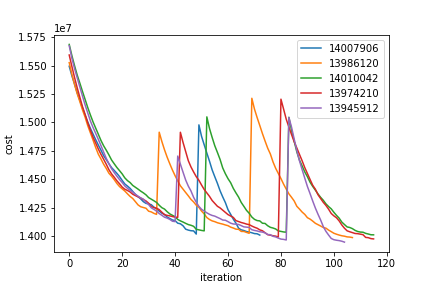</td>
<td align="right">13945912</td>
<td><a href="test_results/ils/tai80a.sol">tai80a.sol</a></td>
<td align="right">148.286</td>
</tr>
<tr>
<td>tai100a</td>
<td>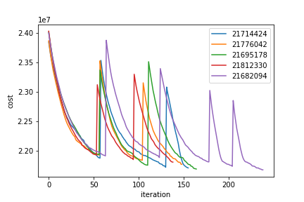</td>
<td align="right">21682094</td>
<td><a href="test_results/ils/tai100a.sol">tai100a.sol</a></td>
<td align="right">420.453</td>
</tr>
</tbody></table>
